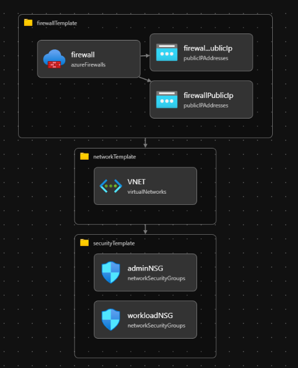

# arm-network-lab

Bicep templates and PowerShell scripts to repeatably deploy the Azure network environment from [azure-internal-app-network-lab](https://github.com/Seth-Cole/azure-internal-app-network-lab) as infrastructure-as-code.

## Architecture Overview

The same network topology from the original click-through lab, expressed as a modular Bicep deployment orchestrated through a parent/child template structure.

- **Virtual network:** `az-lab-vnet` (`10.0.0.0/16`)
- **Subnets:**
  - `AzureFirewallSubnet` (`10.0.1.0/26`) – firewall data plane
  - `az-lab-adsn` (`10.0.2.0/24`) – administrative subnet
  - `az-lab-wlsn` (`10.0.3.0/24`) – workload subnet
  - `AzureFirewallManagementSubnet` (`10.0.4.0/26`) – firewall management plane
- **Azure Firewall Basic** attached to both firewall subnets via two Standard public IPs (data plane and management plane)
- **Network Security Groups** created for admin and workload subnets, deployed first so their IDs can be passed into the VNet at subnet creation time

## Template Structure

| File | Role |
|------|------|
| [main template](/templates/main.bicep) | Orchestrates all child modules and passes outputs between them |
| [security template](/templates/security.bicep) | Deploys both NSGs (no dependencies, runs first) |
| [network template](/templates/network.bicep) | Deploys the VNet with all four subnets inline, NSGs already attached |
| [firewall template](/templates/firewall.bicep) | Deploys the firewall and both public IPs (runs last, needs firewall subnet IDs from network) |
| [parameters json file](/templates/parameters.dev.json) | Environment-specific values (region, prefix, environment tag) |

## Design Decisions

- **Parent/child module pattern** keeps each template focused on one responsibility. `main.bicep` is the only file that knows the full deployment order.
- **Module ordering eliminates the circular dependency.** NSGs deploy first since they have no dependencies. Their IDs flow into `network.bicep` so subnets are created with NSGs already bound. The firewall deploys last because it needs the subnet IDs from network. Each module only receives what it needs — nothing flows backward.
- **Subnets are declared inline inside the VNet** rather than as separate child resources. When subnets are declared individually with `parent:`, ARM fires them in parallel against the same VNet — the network provider can only process one subnet write at a time, which causes an `AnotherOperationInProgress` collision. Inline subnets are a single VNet write operation, so the collision never happens.
- **No firewall rules or post-provisioning config** — this repo intentionally stops at core resource provisioning. Rules, DNS, and UDRs are out of scope here and covered in the original lab.

## How to Run

All three scripts resolve template paths relative to their own location, so they work regardless of where you call them from.

| Script | Purpose |
|--------|---------|
| [what if script](scripts/what-if.ps1) | Dry-run analysis — shows what would be created without touching Azure |
| [deploy script](scripts/deploy.ps1) | Deploys all resources to a specified resource group (creates the RG if it does not exist) |
| [clean up script](scripts/cleanup.ps1) | Deletes the resource group and confirms deletion before exiting |

## Skills Demonstrated

- Bicep template authoring (parameters, variables, modules, outputs, inline subnet declarations)
- Parent/child module wiring and cross-template output passing
- ARM parallel write collision diagnosis and resolution via inline resource declarations
- PowerShell deployment scripting with preflight validation and fail-fast error handling
- Azure Resource Manager what-if analysis for safe infrastructure previewing

## Notes

- All resources deploy into a single resource group so the environment can be torn down in one step.
- Naming follows the convention `{prefix}-{environment}-{resource}` driven by `parameters.dev.json`. Defaults to `az-lab`.
- This repo is the IaC companion to [azure-internal-app-network-lab](https://github.com/Seth-Cole/azure-internal-app-network-lab), which covers the same network with click-through validation and screenshots.

## Future Improvements

- TBD
